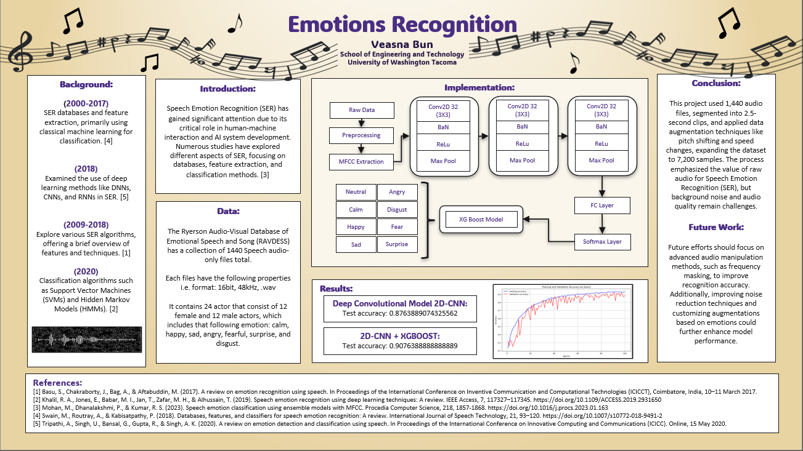

You can download the Emotional Speech Audio Dataset:  
[RAVDESS Emotional Speech Audio Dataset](https://www.kaggle.com/datasets/uwrfkaggler/ravdess-emotional-speech-audio)
 
The models were derived from:  
### Speech Emotion Classification using Ensemble Models with MFCC  
Meera Mohan, P. Dhanalakshmi, R. Satheesh Kumar  
[Research Article](https://www.sciencedirect.com/science/article/pii/S1877050923001631)
